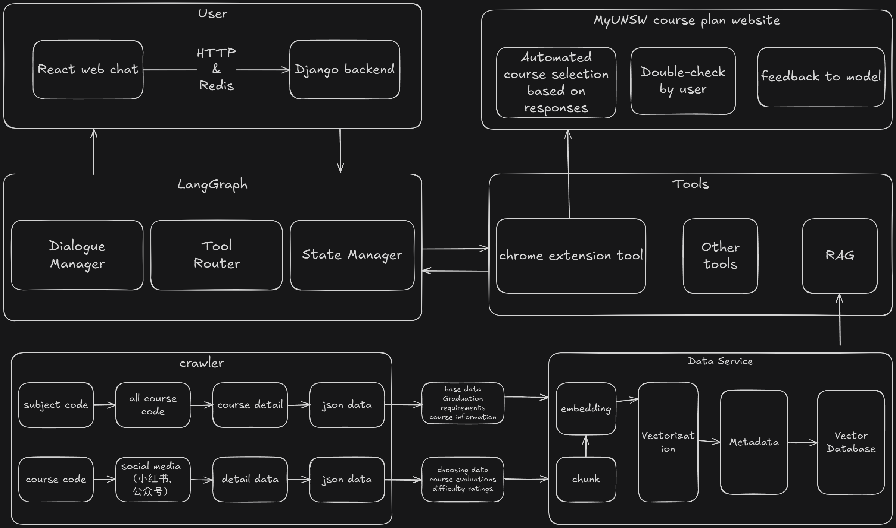

# UNSW 课程顾问 🤖🎓

[English](./document/README_EN.md) | [Deutsch](COMING SOON) | [日本語](COMING SOON) | [Español](COMING SOON)

---

### 🌟 项目简介
**UNSW 课程顾问** 是一个基于人工智能的个性化课程推荐系统，专为新南威尔士大学(UNSW)的学生设计。我们采用先进的RAG（检索增强生成）技术，将繁琐、耗时的手动查询手册过程，转变为智能、高效、数据驱动的课程选择体验。

我们的目标是让每位UNSW学生都能轻松找到最适合自己的课程，无论是为了冲击高分(HD)、寻找高性价比的“水课”、掌握实用技能，还是规划高效的短学期学习路径。

---

### 🎯 核心理念
翻阅厚厚的UNSW手册来寻找理想课程，不仅效率低下，还可能错失良机。本项目致力于通过技术手段彻底改变这一现状。

**核心流程**：
1.  **智能爬取**：自动化采集UNSW官方手册、课程评价等公开数据。
2.  **知识沉淀**：将杂乱的数据清洗、处理后，存入专门构建的向量数据库。
3.  **智能生成**：利用前沿的大语言模型和RAG技术，根据学生的个性化需求，生成基于真实数据的、人类可读的课程建议。

**一句话总结：让你不用再花冤枉钱就可以选好课！**

---

### ✨ 主要特性
-   **📚 实时更新**：定期爬取UNSW官网，确保课程信息、开课时间等数据的准确性和时效性。
-   **🧠 个性化推荐**：深度理解你的选课意图——无论是想冲刺高分(HD)，轻松拿学分(找水课)，学习前沿实用课程，还是计划利用短学期加速毕业，我们都能提供量身定制的建议。
-   **🤖 高效聊天机器人**：基于Qwen和Langgraph构建的智能对话机器人，能够快速、准确地回答你的各类选课疑问。
-   **🔌 [即将推出] Chrome插件集成**：一键唤醒智能助手，自动在myUNSW的Course Plan页面为你规划课程，甚至一键完成enroll操作，将便利性提升到极致。

---

### 🛠️ 技术栈
#### 🏛️ 系统架构
项目采用模块化设计，确保高内聚、低耦合，易于维护和扩展。

**核心模块**：
-   `crawler/`：负责爬取课程URL和详细信息的脚本。
-   `data/`：存储原始爬取数据和处理后的结构化数据。
-   `RAG_database/`：用于解析数据、填充向量数据库，并生成用于检索的嵌入向量。
-   `rag_service/`：项目的核心，提供基于RAG的推荐生成API。
-   `agents/`：定义和管理基于Langgraph的智能代理，负责任务分解和工具调用。
-   `configs/`：集中管理项目配置，包括模型参数、数据库连接和Prompt模板。
-   `evaluation/`：包含评估脚本，用于RAG检索和生成效果的量化评估。
-   `backend/`：基于Django构建的后端服务，提供稳定、可直接调用的API接口。
-   `frontend/`：使用Streamlit构建的基础交互界面（React版本正在规划中）。
-   `tests/`：包含单元测试和集成测试，确保代码质量。
-   `ops/`：包含Docker配置文件和自动化部署脚本。

#### 架构图


---

### 🚀 快速开始
#### 环境要求
-   Python 3.9+
-   Django
-   Node.js & React (未来版本)
-   Chrome 浏览器

#### 安装与运行
1.  **克隆仓库**
    ```bash
    git clone https://github.com/your-username/unsw-course-advisor.git
    cd unsw-course-advisor
    ```

2.  **安装Python依赖**
    ```bash
    pip install -r requirements.txt
    ```

3.  **数据处理流水线**
    * **步骤 3.1: 爬取课程数据** (获取课程URL和详细信息，内置反爬虫策略)
        ```bash
        # subject.txt 存放专业代码
        python crawler/course_all_crawler.py # 根据subject_code爬取全部课程号
        python crawler/course_detail_crawler.py # 根据课程号爬取详细资料
        python crawler/check_missing_courses.py # 检查爬取结果是否完全，删除空数据
        ```
    * **步骤 3.2: 构建向量数据库** (为RAG检索服务准备数据)
        ```bash
        python RAG_database/build_rag_vectorstore.py
        ```

4.  **启动后端Django服务**
    ```bash
    cd backend/
    python manage.py runserver
    ```
    *服务将默认运行在 `http://localhost:8000/`*

5.  **启动前端React界面**
    ```bash
    cd frontend/
    npm install
    npm run dev
    ```
    *现在你可以在浏览器中访问 `http://localhost:5713` 来与应用交互。*

---

### 📈 发展路线图
-   [✔] **基础数据爬取**：定向爬取官网Handbook资料，用作课程描述。
-   [✔] **基础数据库构建**：结构化存储爬取到的课程详细资料。
-   [✔] **向量数据库构建**：为RAG提供高效的语义检索能力。
-   [✔] **聊天机器人**：基于Langgraph实现交互式问答流程。
-   [✔] **RAG集成**：基于Langgraph构建自评判Agent，智能唤起RAG进行检索。
-   [ ] **进阶数据爬取**：采集课程评价数据（如各中介、小红书等），构建更全面的课程画像。
-   [ ] **用户认证系统**：支持学生登录，保存个人专业、已修课程和偏好设置。
-   [✔] **流式输出**：优化聊天机器人交互，实现打字机般的实时响应体验。
-   [ ] **Chrome插件**：实现课程规划和一键选课/Enroll功能。
-   [ ] **向量化与分块优化**：持续优化RAG检索的效果及速度。
-   [✔] **React前端重构**：将前端改成React
-   [ ] **语义聚类**：自动识别内容重复或高度相似的课程。
-   [ ] **架构升级**：引入RPC优化系统性能和用户体验，探索SaaS/PaaS部署模式。

---

### 🤝 贡献指南
我们热烈欢迎社区的贡献！无论是代码、文档还是建议，都对我们至关重要。

1.  **Fork** 本项目。
2.  创建你的功能分支 (`git checkout -b feature/YourAmazingFeature`)。
3.  提交你的更改 (`git commit -m 'Add some AmazingFeature'`)。
4.  将你的分支推送到远程仓库 (`git push origin feature/YourAmazingFeature`)。
5.  提交一个 **Pull Request**，等待审核。

---

### 📧 联系我们
如果你有任何问题、建议或合作意向，请随时通过以下方式联系我：
-   **邮箱**: <tao666918@gmail.com> | <z453676955@qq.com>
-   或者在GitHub上提交一个 **Issue**。

---

### 📄 许可证
本项目基于 **MIT许可证** 进行分发。详情请查阅 `LICENSE` 文件。