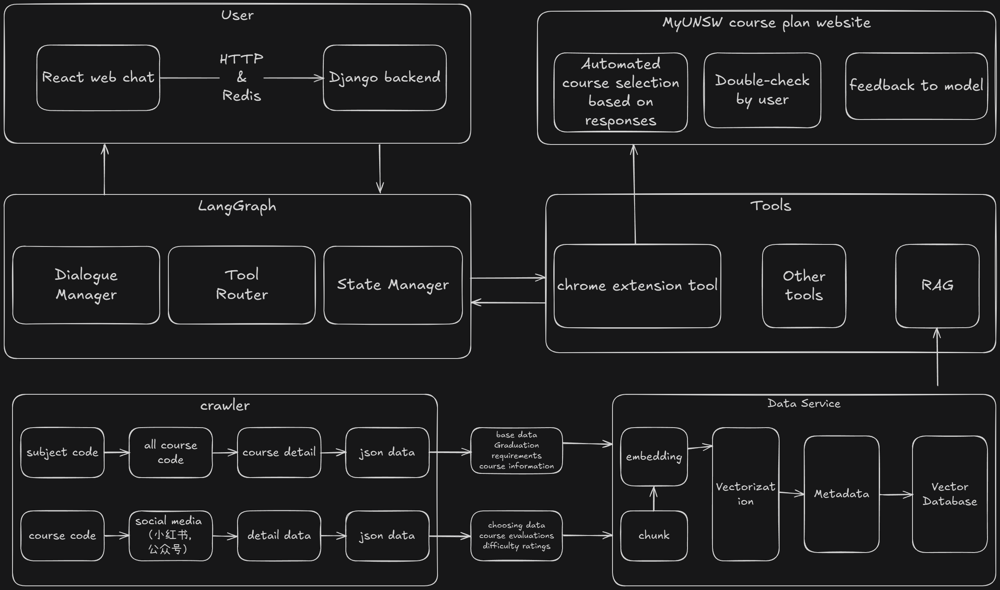

# UNSW Course Advisor [LLM]

[中文](./README.md) | [Deutsch](COMING SOON) | [日本語](COMING SOON) | [Español](COMING SOON)

---

###  Introduction
**UNSW Course Advisor** is an AI-powered, personalized course recommendation system designed specifically for students at the University of New South Wales (UNSW). We leverage advanced Retrieval-Augmented Generation (RAG) technology to transform the tedious and time-consuming process of manual handbook searches into an intelligent, efficient, and data-driven course selection experience.

Our goal is to empower every UNSW student to easily find the courses that best suit their needs—whether it's aiming for a High Distinction (HD), finding easy-to-pass electives, acquiring practical skills, or planning an efficient short-term study path.

---

###  Core Philosophy
Navigating the dense UNSW Handbook to find the ideal courses is inefficient and can lead to missed opportunities. This project aims to completely revolutionize this process through technology.

**Core Workflow**:
1.  **Intelligent Crawling**: Automatically collect public data from the official UNSW Handbook, course reviews, and other sources.
2.  **Knowledge Base Construction**: Clean, process, and store the unstructured data into a purpose-built vector database.
3.  **Intelligent Generation**: Utilize cutting-edge Large Language Models (LLMs) and RAG technology to generate human-readable course recommendations based on students' personalized needs and real data.

**In short: Helping you choose the right courses without wasting money!**

---

### [Result] Key Features
-   **[Docs] Real-time Updates**: Periodically crawls the UNSW official website to ensure the accuracy and timeliness of course information, offerings, and schedules.
-   ** Personalized Recommendations**: Deeply understands your course selection intentions—whether you're aiming for an HD, looking for easy credits, seeking practical skills, or planning to accelerate your graduation with short terms, we provide tailored suggestions.
-   **[LLM] Efficient Chatbot**: An intelligent chatbot built with Qwen and Langgraph, capable of quickly and accurately answering your various course-related questions.
-   ** [Coming Soon] Chrome Extension Integration**: Activate the smart assistant with a single click to automatically plan your courses on the myUNSW Course Plan page, and even one-click enroll, taking convenience to the extreme.

---

### Tech Stack
####  System Architecture
The project follows a modular design to ensure high cohesion, low coupling, and ease of maintenance and scalability.

**Core Modules**:
-   `crawler/`: Scripts responsible for crawling course URLs and their detailed information.
-   `data/`: Stores raw crawled data and processed structured data.
-   `RAG_database/`: Parses data, populates the vector database, and generates embeddings for retrieval.
-   `rag_service/`: The core of the project, providing the RAG-based recommendation generation API.
-   `agents/`: Defines and manages Langgraph-based intelligent agents for task decomposition and tool invocation.
-   `configs/`: Centralized management for project configurations, including model parameters, database connections, and prompt templates.
-   `evaluation/`: Contains evaluation scripts for quantitative assessment of RAG retrieval and generation performance.
-   `backend/`: A Django-based backend service providing stable and ready-to-use API endpoints.
-   `frontend/`: A basic interactive interface built with Streamlit (A React version is in the works).
-   `tests/`: Includes unit and integration tests to ensure code quality.
-   `ops/`: Contains Docker configurations and deployment scripts.

#### Architecture Diagram


---

### [START] Quick Start
#### Prerequisites
-   Python 3.9+
-   Django
-   Node.js & React (for future versions)
-   Chrome Browser

#### Installation & Setup
1.  **Clone the Repository**
    ```bash
    git clone [https://github.com/your-username/unsw-course-advisor.git](https://github.com/your-username/unsw-course-advisor.git)
    cd unsw-course-advisor
    ```

2.  **Install Python Dependencies**
    ```bash
    pip install -r requirements.txt
    ```

3.  **Data Processing Pipeline**
    * **Step 3.1: Crawl Course Data** (Fetches URLs and details with built-in anti-crawling measures)
        ```bash
        # subject.txt contains subject area codes
        python crawler/course_all_crawler.py # Crawls all course codes based on subject_code
        python crawler/course_detail_crawler.py # Crawls detailed info based on course codes
        python crawler/check_missing_courses.py # Verifies completeness and removes empty data
        ```
    * **Step 3.2: Build Vector Database** (Prepares data for the RAG service)
        ```bash
        python RAG_database/build_rag_vectorstore.py
        ```

4.  **Start the Django Backend Service**
    ```bash
    cd backend/
    python manage.py runserver
    ```
    *The service will run at `http://127.0.0.1:8000/` by default.*

5.  **Launch the Streamlit Frontend**
    ```bash
    cd frontend/
    streamlit run app.py
    ```
    *You can now interact with the application by visiting `http://localhost:8501` in your browser.*

---

### [Perf] Roadmap
-   [x] **Basic Data Crawling**: Targeted crawling of the official Handbook for course descriptions.
-   [x] **Basic Database Construction**: Structured storage of crawled course details.
-   [x] **Vector Database Construction**: Enables efficient semantic retrieval for RAG.
-   [x] **Chatbot**: Implemented an interactive Q&A flow using Langgraph.
-   [x] **RAG Integration**: Built a self-critiquing agent using Langgraph to intelligently invoke RAG.
-   [ ] **Advanced Data Crawling**: Collect course review data from sources like agencies and Xiaohongshu to build a more comprehensive course profile.
-   [ ] **User Authentication System**: Support student logins to save personal majors, completed courses, and preferences.
-   [ ] **Streaming Output**: Enhance chatbot interaction with a real-time, typewriter-style response experience.
-   [ ] **Chrome Extension**: Implement course planning and one-click enroll functionality.
-   [ ] **Feedback & Fine-tuning Loop**: Establish a user feedback mechanism to continuously optimize the recommendation model using RLHF techniques.
-   [ ] **Vectorization & Chunking Optimization**: Continuously improve the performance and speed of RAG retrieval.
-   [ ] **A/B Testing Framework**: For scientifically optimizing prompt strategies and retrieval models.
-   [ ] **Semantic Clustering**: Automatically identify duplicate or highly similar courses.
-   [ ] **Degree Requirement Integration**: Integrate with official degree requirements to provide graduation pathway planning.
-   [ ] **CI/CD Integration**: Establish a CI/CD pipeline for automated testing and deployment.
-   [ ] **Architecture Upgrade**: Introduce components like RPC/Redis to optimize system performance and user experience; explore SaaS/PaaS deployment models.

---

###  Contribution Guide
We warmly welcome contributions from the community! Whether it's code, documentation, or suggestions, your input is invaluable to us.

1.  **Fork** this repository.
2.  Create your feature branch (`git checkout -b feature/YourAmazingFeature`).
3.  Commit your changes (`git commit -m 'Add some AmazingFeature'`).
4.  Push to the branch (`git push origin feature/YourAmazingFeature`).
5.  Open a **Pull Request** for review.

---

###  Contact Us
If you have any questions, suggestions, or collaboration inquiries, please feel free to contact me:
-   **Email**: <tao666918@gmail.com> | <z453676955@qq.com>
-   Or open an **Issue** on GitHub.

---

### [Doc] License
This project is distributed under the **MIT License**. See the `LICENSE` file for more information.