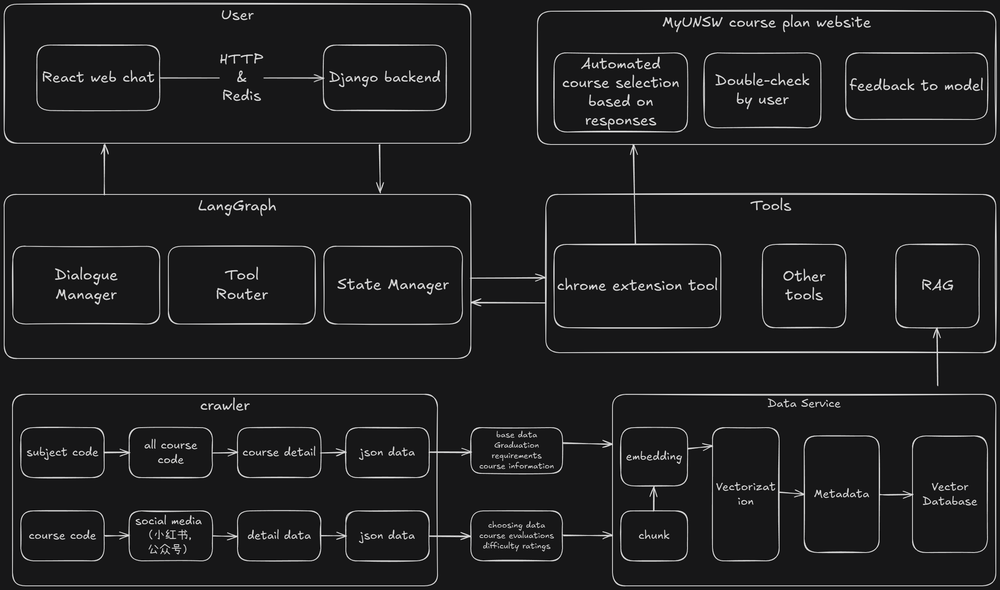

# UNSW 课程顾问 - 系统架构介绍

本项目旨在为 UNSW 学生提供智能化的课程选择辅助。系统采用前后端分离、模块化的设计思路，整合了网络爬虫、向量数据库、大型语言模型 (LLM)、基于 LangGraph 的 AI Agent 以及现代化的 Web 界面和浏览器插件。

## 核心组件

### 1. 数据爬取与 RAG 知识库 (`crawler/`, `RAG_database/`)

- **数据来源**:
  - **官方手册**: `crawler/` 目录下的脚本负责从 UNSW Handbook 网站自动爬取课程列表 (`course_all_crawler.py`)、课程详细信息 (`course_detail_crawler.py`) 和各专业的毕业要求 (`subject_graduation_request.py`)。爬虫包含随机 User-Agent、延迟和重试等反爬虫策略。
  - **(规划中)** 社交媒体/评价网站: 计划爬取如小红书等平台的课程评价数据，丰富知识库。
- **数据处理与向量化 (`RAG_database/`)**:
  - 脚本 (`build_course_datail_vector_db.py`, `build_graduation_detail_vector_db.py`) 负责解析爬取的原始数据 (HTML, JSON)。
  - 进行文本清洗 (如去除 HTML 标签) 和分块 (Chunking) 处理，将长文本切分为适合 Embedding 的片段。
  - 使用 Embedding 模型将文本块转换为高维向量。支持两种模式：
    - **本地模型**: 使用 `sentence-transformers` 库加载本地模型 (如 `all-mpnet-base-v2`)。
    - **API 模型**: 调用兼容 OpenAI 的 API (如阿里云百炼 `text-embedding-v3`) 生成向量。需要配置 API Key。
  - 利用 `faiss` 库构建向量索引文件 (`faiss_index.bin`)，用于快速相似性搜索。
  - 同时生成并保存 `metadata.jsonl` 文件，存储每个向量对应的原始文本片段和来源信息。
  - **(实验性)** 支持并行检索多个索引库并使用 Cross-Encoder 或 Embedding-based 方法进行重排 (`parallel_search_and_rerank.py`)。

### 2. 后端服务 (`backend/`)

- **框架与 API**:
  - 基于 **Django** 和 **Django REST framework (DRF)** 构建 RESTful API 服务。
  - 提供用户认证 (`accounts/`)、聊天 (`chatbot/`)、许可证管理 (`accounts/`) 和插件支持 (`extension/`) 等接口。
  - 聊天接口 (`/api/chatbot/chat_multiround/`) 采用 **Server-Sent Events (SSE)** 实现流式响应，通过 `StreamingHttpResponse` 将 LLM 生成的 token 实时推送给前端。
- **AI Agent (`chatbot/langgraph_agent/`)**:
  - **核心引擎**: 使用 **LangGraph** 库构建了一个基于状态图 (State Graph) 的智能代理。图的结构 (节点和边) 通过 YAML 文件 (`nodes_config.yaml`) 进行配置，易于修改和扩展。
  - **状态管理 (`core.py`)**: 定义了 `ChatState` (TypedDict)，包含了对话消息、用户查询、RAG 结果、路由决策、工具调用信息、最终答案等状态。
  - **主要节点 (`node/` 目录)**:
    - `load_memory`/`save_memory`: 负责从本地文件加载和保存用户对话历史，实现多轮对话记忆。
    - `prepare_input`: 整合当前查询和历史消息，准备 LLM 输入。
    - `router`: 使用 LLM (可配置轻量级模型) 判断用户意图，决定是调用 RAG (`retrieve_rag`)、执行工具 (`call_tool`)、需要用户澄清 (`needs_clarification`) 还是普通聊天 (`general_chat`)。
    - `retrieve`: 调用 RAG 模块 (`rag_chain_qwen.py`) 从向量数据库检索相关文档。
    - `tool_executor`: 根据 `router` 的决策，执行注册在 `tools/` 目录下的相应工具函数。
    - `generate`: 调用核心 LLM (如 Qwen)，结合上下文 (RAG 结果或工具输出) 生成答案。
    - `grounding_check`: (可选) 使用 LLM 验证 `generate` 节点的输出是否与 `retrieve` 节点的结果一致，减少幻觉。
  - **LLM 调用 (`core.py`)**: `call_qwen_sync` 函数封装了对 Qwen API (或其他 OpenAI 兼容 API) 的调用逻辑，支持流式和非流式，并集成了基本的性能监控。
  - **提示词管理 (`node/prompt_loader.py`)**: 动态从 `.prompts.json` 文件加载所有 Prompt 模板，并自动注入核心人设 (`CORE_PERSONA`)。
- **认证与加密 (`accounts/`)**:
  - **用户模型 (`models.py`)**: 使用自定义 `User` 模型 (继承 `AbstractBaseUser`, `PermissionsMixin`)，以 Email 作为用户名，并直接集成了许可证相关字段 (`license_key`, `user_key`, `device_id` 等)。
  - **认证**: 使用 `djangorestframework-simplejwt` 提供基于 JWT 的无状态认证。
  - **加密服务 (`services.py`)**:
    - `CryptoService` 类封装了加密逻辑。
    - 使用服务器主密钥 (`SERVER_MASTER_KEY`) 和 PBKDF2 派生每个用户的唯一密钥 (`user_key`)。
    - 使用 AES-GCM 算法进行加密和解密，确保机密性和完整性。
    - 为每个需要加密的文件生成唯一的文件密钥 (`file_key`)，该密钥用服务器主密钥加密后存储在 `FileKey` 数据库表中。
    - `GetFileDecryptKeyView` 负责根据用户的 `license_key` 找到对应的 `user_key`，然后从数据库取出加密的 `file_key`，用服务器主密钥解密得到明文 `file_key`，再用 `user_key` 重新加密后返回给前端/插件。
- **数据库**: 默认使用 SQLite，生产环境推荐 PostgreSQL 或 MySQL。

### 3. 前端界面 (`frontend/`)

- **技术栈**: **React** (使用 Hooks), **Vite** (构建工具), **TypeScript** (类型安全), **Tailwind CSS** (UI 样式)。
- **状态管理**: 使用 **React Context API** 分别管理认证状态 (`AuthContext`)、聊天状态 (`ChatContext`) 和应用视图状态 (`AppContext`)。`ChatContext` 使用 `localStorage` 持久化聊天记录。
- **核心组件**:
  - **`App.tsx`**: 应用根组件，实现三栏布局 (可调宽度的左侧边栏、主聊天/设置区域、可折叠/调宽度的右侧边栏)。
  - **`Chat.tsx`**: 聊天界面核心，处理消息发送、接收流式响应、渲染消息列表 (`MessageItem`)。
  - **`LeftPanel.tsx`**: 左侧边栏，包含顶部标题/折叠按钮、中部聊天列表/搜索、底部用户信息/登录。包含复杂的许可证激活/查看流程组件。
  - **`RightPanel.tsx`**: 右侧面板，用于展示 RAG 检索结果或其他上下文信息。
  - **`InputPanel.tsx`**: 聊天输入框，支持多行、自动高度、加载状态和停止按钮。
  - **`SettingsPage.tsx`**: 允许用户修改个人资料 (部分占位)、外观 (主题)、安全 (密码) 和账户 (登出)。
- **API 通信 (`api.ts`)**: 封装 `fetch` 调用，统一处理请求、认证 (自动附加 JWT)、错误和流式响应 (SSE) 解析。包含前端所需的加解密辅助函数。

### 4. Chrome 浏览器插件 (`my-extension/`)

- **目的**: 提供便捷的入口，特别是与 UNSW 官方选课页面 (`my.unsw.edu.au`) 集成，实现自动化选课。
- **组件**:
  - **Background Script (`background.js`)**: 作为 Service Worker 运行，处理核心逻辑，如：与 Popup 和 Content Script 的消息传递；调用后端 API (验证许可证、获取课程 ID 映射、获取文件解密密钥)；管理多学期自动选课流程的状态和恢复。
  - **Content Script (`content_script.js`)**: 注入到 UNSW 选课页面。负责实际的页面交互，如：根据 Background Script 的指令切换学期 (`ensureTermActive`)、模拟搜索课程 (`runStep0_SearchCourse`)、提交选课 (`runStep1_SubmitCourses`)、确认选课 (`runStep2_ConfirmEnrolment`)；并将执行结果或状态反馈给 Background Script。
  - **Injector Script (`injector.js`)**: 由 Content Script 注入到 UNSW 页面的主 Window 环境，用于访问页面可能存在的全局 JavaScript 变量或函数 (例如，尝试获取页面自身的认证 Token)。
  - **Popup (`popup.html`, `popup.js`, `popup.css`)**: 用户交互界面。允许用户输入/验证许可证和用户密钥；上传加密的选课文件或手动输入选课列表；触发自动选课流程；显示进度和结果。
- **数据流**: 用户在 Popup 触发 -> `popup.js` 通知 `background.js` -> `background.js` 调用后端 API 获取必要信息 (如课程 ID) -> `background.js` 指令 `content_script.js` -> `content_script.js` 操作 UNSW 页面 -> `content_script.js` 反馈结果 -> `background.js` 更新状态，通知 `popup.js` 显示。文件解密流程类似，涉及 Popup -> Background -> Backend API -> Background -> Popup。

## 架构图




# UNSW 课程顾问 - 使用说明

本指南包含安装、配置和使用 UNSW 课程顾问网页端及 Chrome 插件的详细步骤。

## 1. 环境要求

- **Python**: 3.9 或更高版本。
- **Node.js**: 用于运行前端开发服务器 (推荐 LTS 版本)。
- **pip**: Python 包管理器。
- **npm** 或 **yarn**: Node.js 包管理器。
- **Chrome 浏览器**: 用于安装和运行 `my-extension` 插件。
- **(可选) Git**: 用于克隆代码仓库。
- **(可选) API Keys**:
  - **LLM API Key**: 如阿里云百炼的 `DASHSCOPE_API_KEY`，用于驱动聊天机器人。
  - **Embedding API Key**: 如果 `RAG_database` 配置为使用 API 生成向量，也需要相应的 Key。

## 2. 安装与设置

1.  **克隆代码库**:

    ```bash
    git clone [https://github.com/oceanusxxd/unsw-course-advisor.git](https://github.com/oceanusxxd/unsw-course-advisor.git)
    cd unsw-course-advisor
    ```

2.  **安装后端 Python 依赖**:

    ```bash
    pip install -r requirements.txt
    # !! 重要: requirements.txt 缺失 pycryptodome，需要手动安装 !!
    pip install pycryptodome
    ```

3.  **安装前端 Node.js 依赖**:

    ```bash
    cd frontend/
    npm install
    cd ..
    ```

4.  **配置环境变量**:

    - 在 `backend/` 目录下创建一个名为 `.env` 的文件。
    - 根据需要在此文件中添加以下变量 (根据你的 API Keys 和配置修改)：

      ```dotenv
      # --- LLM & Embedding API ---
      DASHSCOPE_API_KEY=sk-xxxxxxxxxxxxxxxxxxxxxxxxxxxxxxxx  # 阿里云百炼 API Key
      QWEN_MODEL=qwen-plus  # 或 qwen-max, qwen-turbo 等
      # 如果使用不同的 Router 模型
      # ROUTING_MODEL_NAME=qwen-flash
      # USE_FAST_ROUTER=true

      # --- 加密密钥 (!! 必须设置一个强随机密钥 !!) ---
      # 推荐生成方式: python -c "import os, base64; print(base64.b64encode(os.urandom(32)).decode())"
      SERVER_MASTER_KEY=your_strong_base64_encoded_32_byte_key_here

      # --- RAG 数据库路径 (相对于 backend/manage.py) ---
      FAISS_INDEX_PATH=../RAG_database/vector_store/faiss_index.bin
      METADATA_PATH=../RAG_database/vector_store/metadata.jsonl

      # --- 课程 ID 映射文件路径 (用于插件) ---
      COURSE_MAP_PATH=../crawler/course_map.json

      # --- (可选) Django 媒体文件存储 ---
      MEDIA_ROOT=./media  # 加密文件将存储在此目录下的 encrypted/ 子目录
      MEDIA_URL=/media/

      # --- (可选) LangGraph Agent 配置开关 ---
      # ENABLE_GROUNDING_CHECK=true
      # ENABLE_VERBOSE_LOGGING=true
      ```

5.  **运行数据处理流水线**:

    - **爬取数据**:
      - 编辑 `crawler/subject.txt` 文件，填入你想爬取的 UNSW 专业代码 (如 COMP, ACCT)。
      - 运行爬虫脚本 (在 `crawler/` 目录下):
        ```bash
        python course_all_crawler.py      # 获取课程 URL 列表
        python course_detail_crawler.py   # 获取课程详细信息
        python check_missing_courses.py # 检查并补全
        # (可选) python subject_graduation_request.py # 获取毕业要求
        # (可选) python parse_pagecontent.py        # 解析毕业要求
        # (可选) python get_coursemap.py            # 生成 course_map.json
        ```
    - **构建 RAG 知识库**:
      - 编辑 `RAG_database/build_course_datail_vector_db.py` 和 `build_graduation_detail_vector_db.py`，根据你的选择设置 `USE_API_EMBEDDING` (True/False)，并配置相应的模型名称 (`API_MODEL_NAME`/`LOCAL_MODEL_NAME`) 和 API 维度 (`API_DIMENSIONS`)。
      - 运行构建脚本 (在 `RAG_database/` 目录下):
        ```bash
        python build_course_datail_vector_db.py   # 构建课程库
        # (可选) python build_graduation_detail_vector_db.py # 构建毕业要求库
        ```

## 3. 运行服务

1.  **启动后端 Django 服务**:

    ```bash
    cd backend/
    python manage.py runserver
    ```

    _API 服务将在 `http://127.0.0.1:8000/api/` 运行_。

2.  **启动前端 Vite 开发服务器**:
    ```bash
    cd ../frontend/
    npm run dev
    ```
    _前端界面将在 `http://localhost:5173` (或其他端口) 可访问_。

## 4. 网页端使用说明

主要功能包括：

- 访问前端 URL (`http://localhost:5173`)。
- 注册和登录账户。
- 在聊天界面提问，接收流式回复。
- 管理聊天历史 (新建、切换、删除)。
- 激活许可证 (创建试用或验证已有密钥)，**务必保存好 `User Key`**。
- 查看许可证详情。
- 在设置页面修改主题、密码或登出。

## 5. Chrome 插件使用说明

主要功能包括：

- 安装插件 (加载已解压的扩展程序)。
- 登录和激活插件 (使用 `License Key` 和 `User Key`)。
- 自动选课:
  - 准备选课列表 (上传加密文件或手动输入 `学期 课程代码`)。
  - 确保已在浏览器中打开并登录 UNSW 选课页面。
  - 在插件 Popup 中触发“开始批量选课”。
  - 监控进度并**务必在结束后手动核对选课结果**。
- 注意插件对 UNSW 页面结构的依赖性以及 `User Key` 的安全性。

## 6. 开发者调试

- **后端日志**: Django 开发服务器会在控制台输出请求日志和应用日志 (包括 LangGraph Agent 的部分调试信息，如果 `ENABLE_VERBOSE_LOGGING=true`)。
- **前端日志**: 打开浏览器开发者工具 (F12) 查看前端 `console.log` 输出和网络请求。
- **LangGraph 调试**: 在 `.env` 文件中设置 `ENABLE_VERBOSE_LOGGING=true` 可以看到 Agent 节点执行的详细信息。
- **API 测试**: 可以使用 `backend/test/` 目录下的脚本 (如 `test_chat_multi.py`, `test_course_map.py`) 或 Postman/Insomnia 等工具直接测试后端 API。
- **插件调试**: 在 `chrome://extensions/` 页面找到插件，点击“详细信息”，然后点击“Service Worker”或检查弹出窗口/内容脚本的开发者工具。
